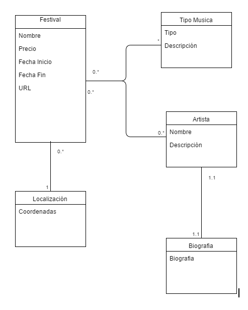

# Ejemplo de crawler + integración de datos

Este programa en python recoge los datos de festivales de la página de [festicket]
  (<http://www.festicket.com/>) y los almacena en un archivo en formato xml con la estructura de la fuente. 

Para ejecutar este programa basta con ejecutar:

      python crawler.py

Una vez se terminan de descargar los datos y de crear el xml, el siguiente paso es transformar los datos al esquema canónico (este programa forma parte de un trabajo de clase) de la imagen. 
Para realizar esta operación se tiene que ejecutar el siguiente comando:

	  python transformer.py

el cual creará un documento html con los datos listos para visualizar más fácilmente, y otro documento xml con los mismos datos pero en el formato del esquema canónico. 

